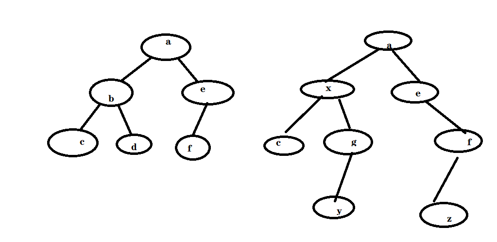
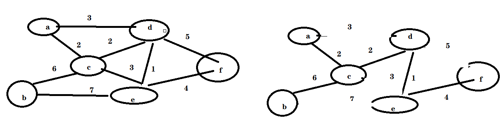
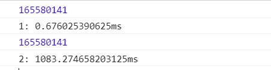

# 线性结构
* 线性结构是数据结构中的一种分类，用于表示一系列元素的有序集合
* 数组、链表、栈、队列

## 数组
* 整个数组占用的内存空间是连续的 ==》用下标查找效率最快 直接计算内存位置
* 数组中元素的数量是固定的 ===》没有办法改变其长度，添加元素 删除元素
* 每个元素占用的内存大小是完全一样的 ===》存储的数据类型是一样的
* js中的数组不是真正的数组，底层实现是链表，es6出现了真正的数组(类型化数组)，但是只能存储数字。 var arr = new Int8Array(10); 

##链表
* 每个元素除了存储数据，需要有额外的内存存储一个引用(地址)，指向下一个元素===》 可以随时的新增 删除元素，占用内存空间大，查找效率慢
* 每个元素占用的内存空间不要求是连续的
* 往往使用链表的第一个节点(根节点)来代表整个链表
* 用下标访问效率很低，所以js中的Array用foreach、forof 比 for循环效率高

# 排序与查找
排序算法没有优劣之分，不同的场景算法执行效率不同
## 选择排序 
* 一次排序过程，可以将最小的元素排列到第一位
1. 找出该区域的最小值
2. 将该值与该区域第一个值交换位置
3. 对下一个区域重复以上过程
``` javascript
        function selectSort(arr) {
            var length = arr.length;
            if (length < 2) return arr;
            var min = null,
                minIndex = 0;
            for (let i = 0; i < length; i++) {
                min = arr[i];
                minIndex = i;
                for (let j = i + 1; j < length; j++) {
                    if (min > arr[j]) {
                        min = arr[j];
                        minIndex = j;
                    }
                }
                arr[minIndex] = arr[i];
                arr[i] = min;
            }
        }
```

## 冒泡排序
* 一次排序过程，可以将某个区域的最大值排列到该区域的最后一位
1. 将第1位与第2位比较，如果前者比后者大则交换
2. 将第2位与第3位比较，如果前者比后者大则交换
3. 以此类推直到比较到该区域的最后两位
4. 重复上述过程 
``` javascript
 function bubbleSort(arr) {
            var length = arr.length;
            if (length < 2) return arr;
            for (let i = 0; i < length - 1; i++) {
                for (let j = 0; j < length - i - 1; j++) {
                    if (arr[j] > arr[j + 1]) {
                        [arr[j], arr[j + 1]] = [arr[j + 1], arr[j]];
                    }
                }
            }
        }
```

## 插入排序
* 将序列分为两个部分，一部分是有序的，一部分是无序的，不断的从无序部分中取出数据插入到有序部分，然后有序部从后往前比较，最后一位与前一位比较，比前一位小则交换，直到有序部分有序。
例如 [5,7,2,3,6]
1. 分为有序和无序的两部分[5,&nbsp;   7,2,3,6]  先假定第0位是有序的
2. 不断扩充有序序列[5,7,&nbsp;   2,3,6]  
3. 不断扩充有序序列[2,5,7,&nbsp;  3,6]  比较2 和 7,2比7小，交换，再比较2和5,2比5小，交换
4. 不断扩充有序序列[2,3,5,7,&nbsp; 6]
5. 不断扩充有序序列[2,3,5,6,7 &nbsp;]
6. 排序完成
``` javascript
  function insertSoft(arr) {
            var length = arr.length;
            if (length < 2) return arr;
            for (let i = 1; i < length; i++) {
                if (arr[i] < arr[i - 1]) {
                    for (let j = i; j > 0; j--) {
                        if (arr[j] < arr[j-1]) {
                            [arr[j] ,arr[j-1]]=[arr[j-1] ,arr[j]];
                        }else{
                            break;
                        }
                    }
                }
            }
        }
```

## 快速排序

在每一轮挑选一个基准元素，并让其他比它大的元素移动到数列一边，比它小的元素移动到数列的另一边，从而把数列拆解成了两个部分。

### 填坑法
[4,7,6,5,3,2,8,1]
1. 首先，我们选定基准元素Pivot，并记住这个位置index，这个位置相当于一个“坑”。并且设置两个指针left和right，指向数列的最左和最右两个元素
2. 接下来，从right指针开始，把指针所指向的元素和基准元素做比较。如果比pivot大，则right指针向左移动；如果比pivot小，则把right所指向的元素填入坑中。
3. 在当前数列中，1<4，所以把1填入基准元素所在位置，也就是坑的位置。这时候，元素1本来所在的位置成为了新的坑。同时，left向右移动一位。
4. 接下来，我们切换到left指针进行比较。如果left指向的元素小于pivot，则left指针向右移动；如果元素大于pivot，则把left指向的元素填入坑中。
5. 在当前数列中，7>4，所以把7填入index的位置。这时候元素7本来的位置成为了新的坑。同时，right向左移动一位。
6. 下面按照刚才的思路继续排序：
7. 8>4，元素位置不变，right左移
8. 2<4，用2来填坑，left右移，切换到left。
9. 6>4，用6来填坑，right左移，切换到right。
10. 3<4，用3来填坑，left右移，切换到left。
11. 5>4，用5来填坑，right右移。这时候left和right重合在了同一位置。
12. 这时候，把之前的pivot元素，也就是4放到index的位置。此时数列左边的元素都小于4，数列右边的元素都大于4，这一轮交换终告结束。

``` javascript
   function fastSoft(arr) {
            var length = arr.length;
            if (length < 2)
                return arr;

            function _fastSoft(left, right) {
                if (left >= right)
                    return;
                var i = left,
                    j = right,
                    tmp = arr[left];

                while (i < j) {
                    while (i < j && arr[j] > tmp) {
                        j--;
                    }
                    if (i < j) {
                        arr[i] = arr[j];
                        i++;
                    }
                    while (i < j && arr[i] < tmp) {
                        i++;
                    }
                    if (i < j) {
                        arr[j] = arr[i];
                        j--;
                    }
                }
                //i == j
                arr[i] = tmp;
                _fastSoft(left, i - 1);
                _fastSoft(i + 1, right);
            }

            _fastSoft(0, length - 1);
        }
```

### 指针交换法
1. 开局和挖坑法相似，我们首先选定基准元素Pivot，并且设置两个指针left和right，指向数列的最左和最右两个元素：
2. 接下来是第一次循环，从right指针开始，把指针所指向的元素和基准元素做比较。如果大于等于pivot，则指针向左移动；如果小于pivot，则right指针停止移动，切换到left指针。
3. 在当前数列中，1<4，所以right直接停止移动，换到left指针，进行下一步行动。
4. 轮到left指针行动，把指针所指向的元素和基准元素做比较。如果小于等于pivot，则指针向右移动；如果大于pivot，则left指针停止移动。
5. 由于left一开始指向的是基准元素，判断肯定相等，所以left右移一位。
6. 由于7 > 4，left指针在元素7的位置停下。这时候，我们让left和right指向的元素进行交换。
7. 接下来，我们进入第二次循环，重新切换到right向左移动。right先移动到8，8>2，继续左移。由于2<8，停止在2的位置。
8. 切换到left，6>4，停止在6的位置。
9. 元素6和2交换。
10. 进入第三次循环，right移动到元素3停止，left移动到元素5停止。
11. 元素5和3交换。
12. 进入第四次循环，right移动到元素3停止，这时候请注意，left和right指针已经重合在了一起。
13. 当left和right指针重合之时，我们让pivot元素和left与right重合点的元素进行交换。此时数列左边的元素都小于4，数列右边的元素都大于4，这一轮交换终告结束。 

``` javascript
 function fastSoftEx(arr) {
            var length = arr.length;
            if (length < 2)
                return;

            function _fastSoft(left, right) {
                if (left >= right)
                    return;
                var i = left,
                    j = right,
                    tmp = arr[i];
                while (i < j) {
                    while (i < j && arr[j] >= tmp) {
                        j--;
                    }
                    while (i < j && arr[i] <= tmp) {
                        i++;
                    }
                    if (i < j) {
                        [arr[i], arr[j]] = [arr[j], arr[i]];
                    }
                }
                //i == j
                arr[left] =  arr[i];
                arr[i] = tmp;
                _fastSoft(left, i - 1);
                _fastSoft(i + 1, right);
            }

            _fastSoft(0, length - 1);

        }

```

## 顺序查找
```javascript
   function orderSearch(arr, item) {
            for (let i = 0; i < arr.length; i++) {
                if (arr[i] == item)
                    return i;
            }
            return -1;
        }
```
## 二分查找

```javascript
        function binarySearch(arr, item) {
            if (arr.length == 0 || item < arr[0] || item > arr[arr.length - 1])
                return -1;
            var minIndex = 0,
                maxIndex = arr.length-1,
                midIndex = Math.floor((minIndex + maxIndex) / 2);
            while (minIndex <= maxIndex) {
                if (arr[midIndex] == item)
                    return midIndex;
                else if (arr[midIndex] < item) {
                    midIndex++;
                } else {
                    midIndex--;
                }
            }
            return -1;
        }


        function binarySearch(arr, item) {
            if (arr.length == 0 || item < arr[0] || item > arr[arr.length - 1])
                return -1;
            function _binarySearch(minIndex, maxIndex) {
                if (minIndex > maxIndex)
                    return -1;
                var midIndex = Math.floor((minIndex + maxIndex) / 2);
                if (arr[midIndex] == item)
                    return midIndex;
                else if (arr[midIndex] < item) {
                    midIndex++;
                    return _binarySearch(midIndex, maxIndex);
                } else {
                    midIndex--;
                    return _binarySearch(minIndex, midIndex);
                }
            }
            return _binarySearch(0, arr.length - 1);
        }
       
```

## 插值查找
对于有序且步长差不多的数组，插值查找更快
``` javascript
       function insertSearch(arr, item) {
            if (arr.length == 0 || item < arr[0] || item > arr[arr.length - 1])
                return -1;
            var minIndex = 0,
                maxIndex = arr.length - 1,
                //(目标值-最小值) / (最大值-最小值) 约等于 (目标值索引 - 最小值索引) / (最大值索引- 最小值索引)
                midIndex = Math.floor((item - arr[minIndex]) / (arr[maxIndex] - arr[minIndex]) * (maxIndex - 0) + 0);
            while (minIndex <= maxIndex) {
                if (arr[midIndex] == item)
                    return midIndex;
                else if (arr[midIndex] < item) {
                    midIndex++;
                } else {
                    midIndex--;
                }
            }
            return -1;
        }
```
# 树
* 单根 ： 只有一个父亲
* 无环 ： 没有环状结构
* 结点的度: 该结点子节点的数量
* 树的度： 一棵树中，最大的结点的度
* 结点的层：根为第一层，根的子节点为第二层，依次类推
* 树的高度或深度：树中结点的最大层次
* 叶子结点：度为0的结点
* 分支结点：非叶子结点
* 子结点，父节点：相对概念
* 兄弟结点：两个结点有同一个父节点
* 祖先结点：该结点到根节点的所有结点
* 后代结点：所有的子孙结点

``` js
 function Node() {
            this.value = '';
            this.children = [];
        }
```

## 二叉树
度为2的树
```js 
  function Node() {
            this.value = '';
            this.left = null;
            this.right = null;
        }
```
### 先序遍历
``` js
  function dlf(root) {
            if (!root) return;
            console.log(root.value);
            dlf(root.left);
            dlf(root.right);
        }
```

### 中序遍历

```js
      function ldf(root) {
            if (!root) return;
            ldf(root.left);
            console.log(root.value);
            ldf(root.right);
        }
```
### 后序遍历

```js 
  function lfd(root) {
            if (!root) return;
            lfd(root.left);
            lfd(root.right);
            console.log(root.value);
        }
```

### 根据先序遍历 和 中序遍历 得出后序遍历
* 可以先得到树的结构 再求后序遍历
* 不能根据先 和  后 得到中
``` js 
    function getTree(dlf, ldf) {
            var dlf = dlf.split('');
            var ldf = ldf.split('');
            if (dlf.length != ldf.length)
                throw new Error('参数有误');
            if (dlf.length == 0)
                return null;
            var root = new Node(dlf[0]);
            var index = ldf.indexOf(dlf[0]);
            root.left = getTree(dlf.slice(1, index + 1).join(''), ldf.slice(0, index).join(''));
            root.right = getTree(dlf.slice(index + 1).join(''), ldf.slice(index + 1).join(''));
            return root;
        }
```

### 求树的深度
``` js
  function getDeep(root) {
            if (root == null)
                return 0;
            return Math.max(getDeep(root.left), getDeep(root.right)) + 1;
        }
```
### 树深度遍历

``` js
 function deepFirst(root) {
            if (!root) return;
            console.log(root.value);
            deepFirst(root.left);
            deepFirst(root.right);
        }

```
### 树广度遍历

``` js
      function guangFirst(root) {
            function _guangFirst(nodes) {
                if (!nodes || nodes.length == 0) return;
                var nexts = [];
                nodes.forEach(node => {
                    if (node) {
                        console.log(node.value);
                        node.left && nexts.push(node.left);
                        node.right && nexts.push(node.right);
                    }
                });

                _guangFirst(nexts);
            }
            _guangFirst([root]);
        }
```
### 比较树
``` js
   function compareTree(srcRoot, targetRoot) {
            if (!srcRoot && targetRoot) {
                console.log(`增加了${targetRoot.value}`);
            } else if (srcRoot && !targetRoot) {
                console.log(`减少了${srcRoot.value}`);
            } else if (srcRoot && targetRoot) {
                if (srcRoot.value !== targetRoot.value) {
                    console.log(`${srcRoot.value}改变为${targetRoot.value}`);
                }
                compareTree(srcRoot.left, targetRoot.left);
                compareTree(srcRoot.right, targetRoot.right);
            }
        }
```



# 图
``` js
function Figure(value) {
            this.value = value;
            this.neighbor = [];
        }
```

## 深度遍历
``` js
 function deepFirstFigure(node) {

            function _deepFirstFigure(node, hadArr) {
                if (!node)
                    return;
                console.log(node.value);
                hadArr.push(node);
                if (!node.neighbor || node.neighbor.length == 0)
                    return;
                node.neighbor.forEach(item => {
                    if (!hadArr.includes(item)) {
                        _deepFirstFigure(item, hadArr);
                    }
                });
            }
            _deepFirstFigure(node, []);
        }

```

## 广度遍历
``` js 
  function guangFirstFigure(node) {

            function _guangFirstFigure(nodes, hadArr) {
                if (!nodes || nodes.length == 0)
                    return;
                var nexts = [];
                nodes.forEach(item => {
                    if (item &&  !hadArr.includes(item)) {
                        console.log(item.value);
                        hadArr.push(item);
                        if (item.neighbor && item.neighbor.length != 0) {
                            item.neighbor.forEach(item1 => {
                                if (!nexts.includes(item1) && !hadArr.includes(item1)) {
                                    nexts.push(item1);
                                }
                            });
                        }
                    }
                });
                _guangFirstFigure(nexts, hadArr);
            }
            _guangFirstFigure([node], []);
        }
       
```

## 最小生成树

```js 
 function minFigureToTree(nodes, distanceArr) {
            if (!nodes || nodes.length < 2)
                return;
            if (nodes.length != distanceArr.length || nodes.length != distanceArr[0].length)
                return;
            var length = nodes.length;
            var arr = [nodes[1]];
            var distance = [];
            var minDistance = Infinity;
            var minDistanceNodeA = null;
            var minDistanceNodeB = null;
            var lineArr = [];
            while (arr.length < length) {
                minDistance = Infinity;
                minDistanceNodeA = null;
                minDistanceNodeB = null;
                arr.forEach(item => {
                    distance = distanceArr[nodes.indexOf(item)];
                    distance.forEach((item1, index) => {
                        if (item1 != 0 && item1 != Infinity && !arr.includes(nodes[index]) && item1 <
                            minDistance) {
                            minDistance = item1;
                            minDistanceNodeA = item;
                            minDistanceNodeB = nodes[index];
                        }
                    });
                });
                arr.push(minDistanceNodeB);
                lineArr.push(`${minDistanceNodeA.value}=>${minDistanceNodeB.value}`);
            }
            console.log(lineArr);
        }
        var a = new Figure('a');
        var b = new Figure('b');
        var c = new Figure('c');
        var d = new Figure('d');
        var e = new Figure('e');
        var f = new Figure('f');
        var nodes = [a, b, c, d, e, f];
        var distanceArr = [
            [0, Infinity, 2, 3, Infinity, Infinity],
            [Infinity, 0, 6, Infinity, 7, Infinity],
            [2, 6, 0, 2, 3, Infinity],
            [3, Infinity, 2, 0, 1, 5],
            [Infinity, 7, 3, 1, 0, 4],
            [Infinity, Infinity, Infinity, 5, 4, 0],
        ];
        minFigureToTree(nodes, distanceArr);

```


# 贪心算法
当遇到一个求解全局最优解问题时，如果可以将全局问题切分为小的局部问题，并寻求局部最优解，同时可以证明局部最优解累计的计算结果就是全局最优解，则可以使用贪心算法 
找零问题： 46分 从25 10 5 1 中找出，要求数额正确且硬币数最小
```
 function findZero(total, arr) {
            var arr1 = [];
            function _findZero(total, arr) {
                if (total == 0) return;
                var i = Math.max(...arr.filter(item => item <= total));
                arr1.push(i);
                _findZero(total - i, arr);
            }
            _findZero(total, arr);
            console.log(arr1);
            return arr1;
        }
        findZero(46, [25, 10, 5, 1]);
```

# 动态规划
在分治法的基础上加入了记忆缓存，防止计算多次
青蛙跳台阶问题 ==>

``` js
  function Steps1(n) {
            if (n == 1) return 1;
            if (n == 2) return 2;
            return Steps1(n - 1) + Steps1(n - 2);
        }

 function Steps2(n) {
            var arr = [];
            var value = 0;

            function _steps(n) {
                if (n == 1) {
                    value = 1;
                    return 1;
                }
                if (n == 2) {
                    value = 2;
                    return 2
                }
                value = (arr[n - 1] || _steps(n - 1)) + (arr[n - 2] || _steps(n - 2));
                arr[n] = value;
                return value;
            }
            return _steps(n);
        }

        console.time("1");
        console.log(Steps2(40));
        console.timeEnd("1");

        console.time("2");
        console.log(Steps1(40));
        console.timeEnd("2");

//解决step2爆栈问题 step2是自顶而下的计算，这个改为自底而上
function step3(n) {
            if (n < 2) return 1;
            var dp = new Array(n + 1);
            dp[0] = dp[1] = 1;
            for (let i = 2, length = dp.length; i < length; i++) {
                const element = dp[i];
                dp[i] = dp[i - 1] + dp[i - 2];
            }
            return dp[n];
        }
```


